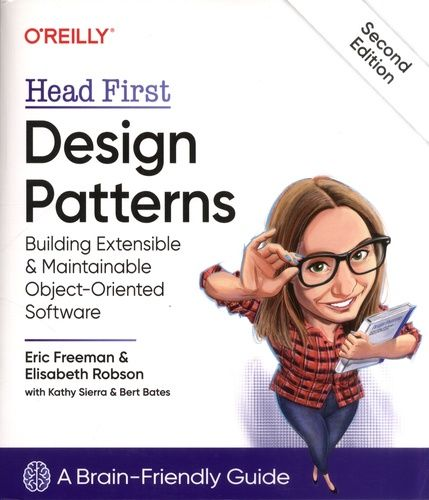

# Implementation of design patterns in Python

[](https://github.com/balancy/design_patterns_head_first/actions/workflows/ci.yml)



## Description

1. [x] [Strategy](patterns/chapter_01_strategy/)

**Strategy is a behavioral design pattern that turns a set of behaviors into objects and makes them interchangeable inside the original context object.**

Different implementations of the Duck abstract class use different fly and quack behavior. Specific behavior is injected during Duck instance initialization.

2. [x] [Observer](patterns/chapter_02_observer/)

**The observer pattern defines a one-to-many dependency between objects so that when one object changes state, all of its dependents are notified and updated automatically.**

Different sensor displays are subscribed to the weather station. When the weather station changes its measurements, all displays are notified.

3. [x] [Decorator](patterns/chapter_03_decorator/)

**The Decorator is a structural design pattern that lets you attach new behaviors to objects by placing these objects inside special wrapper objects that contain the behaviors.**

Condiment class is a decorator that wraps condiment class instance of beverage instance. So we could build a chain of condiments wrappers above beverages. It keeps beverage implementation close for modification, but open for extension.

4. [x] [Abstract factory](patterns/chapter_04_abstract_factory/)

**Abstract Factory is a creational design pattern that lets you produce families of related objects without specifying their concrete classes.**

5. [x] [Factory method](patterns/chapter_04_factory_method/)

**Factory Method is a creational design pattern that provides an interface for creating objects in a superclass but allows subclasses to alter the type of objects that will be created.**

6. [x] [Singleton](patterns/chapter_05_singleton/)

**Singleton is a creational design pattern that lets you ensure that a class has only one instance while providing a global access point to this instance.**

The Singleton class creates a new instance or returns the existing one on instance creation.

7. [x] [Command](patterns/chapter_06_command/)

**The command is a behavioral design pattern that turns a request into a stand-alone object that contains all information about the request. This transformation lets you pass requests as method arguments, delay or queue a request’s execution, and support undoable operations.**

The invoker gives commands to receivers via a common interface and keeps the list of executed commands. When needed, we could undo commands from the last to the first one.

8. [x] [Adapter](patterns/chapter_07_adapter/)

**The adapter is a structural design pattern that allows objects with incompatible interfaces to collaborate.**

There are two types of adapter: object and class adapter, one is implemented via composition and another one is implemented via multiple inheritance.
The turkey adapter for duck allows the execution of duck methods on the Turkey class instance.

9. [x] [Facade](patterns/chapter_07_facade/)

**The facade is a structural design pattern that provides a simplified interface to a library, a framework, or any other complex set of classes.**

The home theater facade class allows 'watch movie' and 'end movie' methods that encapsulate the complex logic of orchestrating all necessary devices.

10. [x] [Template method](patterns/chapter_08_template_method/)

**The Template Method is a behavioral design pattern that defines the skeleton of an algorithm in the superclass but lets subclasses override specific steps of the algorithm without changing its structure.**

The abstract caffeine beverage class has 2 implementations: Tea and Coffee. It contains a few abstract methods which are implemented their proper way in the child classes.


## Run

You need to have at least Python3.8 installed.

1. Clone the repo
```sh
git clone https://github.com/balancy/design_patterns_head_first.git
```

2. Run specific pattern example
```sh
python3 -m patterns.chapter_01_strategy.main
```

## Test and Lint

You also need to have Poetry installed.

Run linting
```sh
make lint
```

Run type checking
```sh
make typecheck
```

Run tests
```sh
make test
```

Run all together
```sh
make check
```